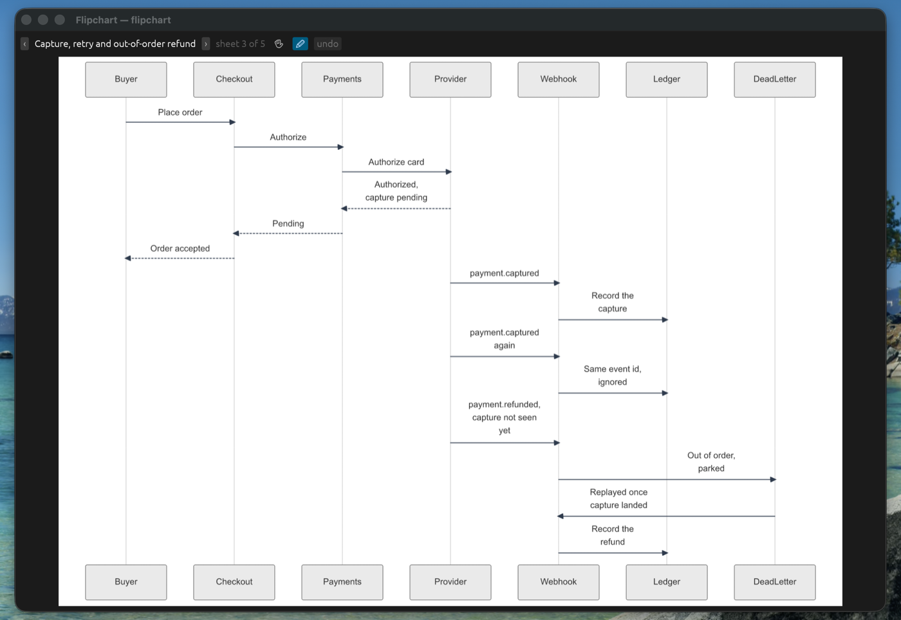
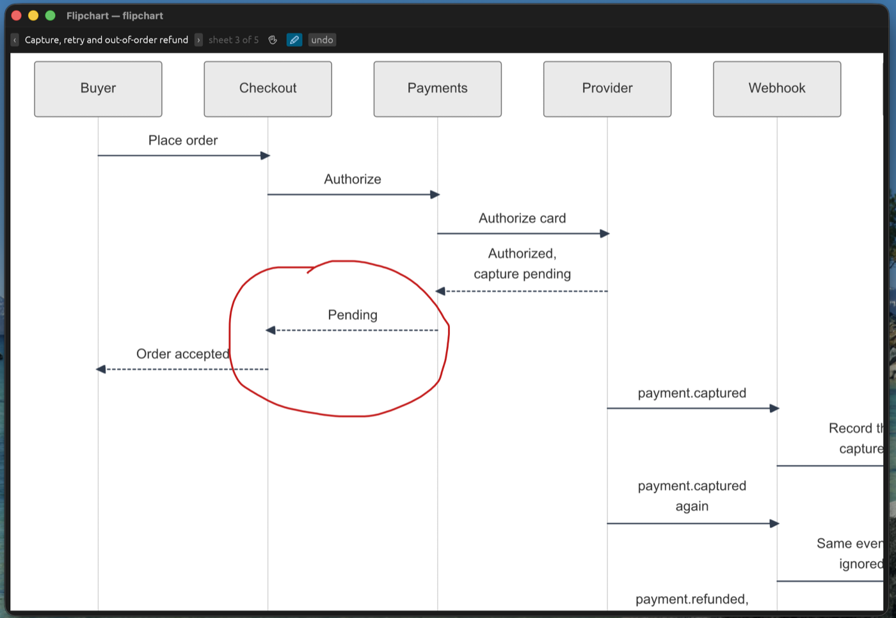

<div align="center">


# flipchart

**Before you write the code, the agent shows you the flow — and what its plan leaves
behind — on a real whiteboard instead of painting it in ASCII inside the chat. And you can
draw back.**

A **Claude Code plugin for macOS and Linux** — an ephemeral visual channel for your agent.
One native binary, two lines to install.

[The problem](#the-problem) · [When it earns its place](#when-it-earns-its-place) · [A session](#a-session) · [Install](#install) · [What you can ask](#what-you-can-ask) · [How it works](#how-it-works) · [What it is made of](#what-it-is-made-of)

</div>

> **Note:** it installs into a Claude Code environment, and that is the only install path
> ([ADR 0013](./docs/adr/0013-the-plugin-is-the-only-install-path.md)). The binary is an
> ordinary MCP server over stdio, so other hosts are not impossible — they are
> **undocumented, untested and unsupported**, and the trigger, the tool name and the skill
> below are all Claude Code's. It is early: six diagram families are measured, `subgraph`
> grouping is the weak spot, and Windows is neither tested nor promised.

## The problem

You are about to touch the payment capture of a service you did not write, so you ask the
agent how it works today. Seven parts, fourteen messages, a duplicate webhook and a refund
that overtakes its own capture. The agent has exactly one surface to answer on — the chat —
so it paints it there:

```
Buyer      Checkout   Payments   Provider   Webhook    Ledger     DeadLetter
  |          |          |          |          |          |          |
  |--place-->|          |          |          |          |          |
  |          |--auth--->|          |          |          |          |
  |          |          |--card--->|          |          |          |
  |          |          |<--ok(*1)-|          |          |          |
  |          |<--pend---|          |          |          |          |
  |<--acc'd--|          |          |          |          |          |
  |          |          |          |--capt--->|          |          |
  |          |          |          |          |--rec---->|          |
  |          |          |          |--capt--->|          |          |  (*2)
  |          |          |          |          |--ign---->|          |
  |          |          |          |--refnd-->|          |          |  (*3)
  |          |          |          |          |--park-------------->|
  |          |          |          |          |<--replayed----------|  (*4)
  |          |          |          |          |--rec---->|          |

(*1) "authorized, capture pending" — it does not fit in ten columns.
(*2) the same event id as three rows above: this is the duplicate, and the drawing
     cannot say that the two arrows carry the same id.
(*3) payment.refunded, and the capture it belongs to has not been seen yet. The
     ordering is the entire point and the picture cannot express it.
(*4) replayed only once the capture had landed, which was four rows earlier, so the
     arrow appears to come from nowhere.
```

Every label is abbreviated to six characters, the arrow to the dead letter queue is drawn
straight through the Ledger's lifeline, and the three things you actually asked about —
which event is the duplicate, that the refund overtook the capture, and why the replay
works — are all down in the footnotes.

It cost a few hundred tokens of pipes and dashes to get there. It does not survive a
narrower terminal, another font or a paste into Slack. And in ten turns it is lost in the
scrollback, right when you start writing the code.

## When it earns its place

Two moments, both of them before the diff exists:

- **The agent has to explain a flow to you.** Who calls whom, in what order, what happens
  on the retry. You are reading unfamiliar code and the answer is a shape, not a paragraph.
- **You want to see what the plan leaves behind.** You asked for a plan; a list of steps
  does not tell you the shape of the system afterwards. The sheet does, and it is cheap to
  reject a box on the wall and expensive to reject it in a pull request.

The rest of the time the agent stays in prose. Drawing is the exception, not the default
([ADR 0017](./docs/adr/0017-drawing-is-the-exception.md)).

## A session

**1. You ask how the capture flow works before you touch it.**

The agent answers in prose, and writes the exchange as meaning — no colors, no shapes, no
direction.

A native window comes to the front and does not take the keyboard, so you never stop
typing.



Seven lifelines, fourteen messages, every label whole. The duplicate `payment.captured`
that the webhook ignores, the `payment.refunded` that arrives **before** its capture, the
park in the dead letter queue and the replay after it. No footnotes.

**2. You spot something and circle it.**



Checkout tells the buyer the order is accepted while the capture is still pending. What if
the capture never arrives?

**3. The agent answers what you circled, by redrawing.**

It gets the sheet back with your ink baked into it — not coordinates, the picture — so it
knows what you pointed at. It redraws the exchange with an `Expiry` holding the order while
the capture is pending, releasing the hold when the capture lands, and expiring the order
and voiding the authorization when nothing lands in thirty minutes.

That drawing is the plan: what the code will look like after you implement it, agreed
before a single line exists.

You speak in ink, the agent speaks in meaning, and neither writes on the other's side.
Your circle never edits the diagram underneath, and the ink disappears when the answer
arrives, because the redraw *is* the reply.

**4. You write the code, and the whiteboard is gone.**

Nothing was saved. No history, no export, no directory of stale diagrams to find six months
from now, when the capture flow no longer looks like that
([ADR 0011](./docs/adr/0011-the-mcp-session-rules.md)).

## Install

Two lines inside Claude Code:

```
/plugin marketplace add https://raw.githubusercontent.com/javierponferradalopez/flipchart/main/marketplace.json
/plugin install flipchart@flipchart
```

And a third step that is **not optional** — paste this into your `CLAUDE.md`:

```
Explain in prose. Draw on the flipchart with mcp__plugin_flipchart_flipchart__show
in exactly two cases: when you catch yourself starting an ASCII diagram, and when
I ask you to draw something.
```

Without it the flipchart sits installed and never gets used: on its own initiative the
agent never reaches for the window — **0 out of 36 turns** measured
([ADR 0012](./docs/adr/0012-the-trigger-lives-outside-the-binary.md)) — and paints the
graph in ASCII instead.

**Requirements:** a Claude Code with plugin support, on **macOS 11 or later** (Intel or Apple
Silicon) or on **Linux `x86_64` with glibc 2.35 or later** — Ubuntu 22.04 and later, Debian 12,
current Fedora. **Nothing else**: no Node, no Python, no browser, no Rust toolchain. The window
opens on the machine you are sitting at, so a remote or cloud agent cannot use it
([ADR 0015](./docs/adr/0015-what-this-product-is-not.md)), and a session with no display —over
SSH, in a container— says so instead of drawing into the void.

On Linux, X11 and Wayland both work from the same binary, with one difference worth knowing:
on Wayland no program can raise its own window, so when the agent draws, the flipchart **asks**
for your attention and your compositor decides what to do with it. Your keyboard is never
taken, on either ([ADR 0019](./docs/adr/0019-two-machines-one-box.md)).

<details>
<summary>Updating, uninstalling, and two names that bite</summary>

```
/plugin update flipchart@flipchart
/plugin uninstall flipchart@flipchart
```

The trailing `@flipchart` is **not optional on `update`**: with the short name it answers
`Plugin "flipchart" not found` even though `/plugin` lists it. What comes after the `@` is
the marketplace, which is called the same as the plugin. `/plugin` opens the menu and does
the same without typing names.

`mcp__plugin_flipchart_flipchart__show` is the name Claude Code presents the tool under
when flipchart arrives as a plugin: the host composes the server name as
`plugin:<plugin>:<server>`. Write `mcp__flipchart__show` in your `CLAUDE.md` and you are
naming a tool that does not exist.

`uninstall` takes the plugin's data with it, so there is no `rm -rf` to type. To turn it
off without uninstalling, `/plugin`.

</details>

## What you can ask

You never pick a diagram type. You ask in your own words and the agent chooses the family
from what it is explaining, with a skill that ships inside the plugin
([ADR 0018](./docs/adr/0018-the-box-carries-one-skill.md)).

| What you ask, mid-implementation | What lands on the sheet |
|:---|:---|
| *"What happens when the provider retries the webhook?"* | the exchange over time, participant by participant |
| *"What does the system look like after your plan?"* | the same exchange with the plan applied — a box you can reject now |
| *"How does this flow work before I touch it?"* · *"What depends on what?"* | the graph in one glance, every edge drawn |
| *"What states can an order be in once I add this?"* | the lifecycle, and what moves it between states |
| *"What do these types look like?"* | the classes, their fields and their relations |
| *"Which tables does this touch, and how do they relate?"* | the records and the relations between them |
| *(you circle something on the sheet)* | the answer to what you circled, as a redraw |

Today's flow and the plan can sit on the flipchart at the same time: several sheets coexist
and the agent turns the page — one at a time, no index, no tab bar to manage
([ADR 0009](./docs/adr/0009-one-sheet-no-index.md)).

## How it works

- **One process, no IPC.** A single native binary is both the MCP server and the window,
  split across two threads ([ADR 0001](./docs/adr/0001-one-process-two-threads-no-ipc.md)).
  It is not a web app in a window; there is no web app.
- **Two tools, and only two.** `show` and `clear`, plus the marks coming back
  ([ADR 0008](./docs/adr/0008-two-tools-and-only-two.md)).
- **It refuses rather than lie.** Renderers invent nodes: hand one a typo and it
  manufactures a box with a plausible label. This one checks the parsed graph against what
  the agent wrote, and when the picture would show a node nobody declared it draws nothing
  and says why ([ADR 0004](./docs/adr/0004-the-honest-limit.md)). What is seen in excess is
  rejected; what is seen short is drawn and warned about — you never plan against an
  invented box.
- **Ephemeral on purpose.** The plan on the wall is true for as long as the session, which
  is exactly as long as it is true in your head
  ([ADR 0011](./docs/adr/0011-the-mcp-session-rules.md)).

What it will never do is in [ADR 0015](./docs/adr/0015-what-this-product-is-not.md).

## What it is made of

Four things, and no browser anywhere.

- **Rust, in one native binary.** The MCP server and the window are the same executable —
  universal for Intel and Apple Silicon on macOS, `x86_64` on Linux, and the plugin picks the
  one your machine can run ([ADR 0019](./docs/adr/0019-two-machines-one-box.md)). Nothing else
  arrives with it and nothing else has to be on the machine.
- **MCP over stdio.** The host launches the binary as a child process and talks to it on
  its standard input. That is the entire interface the agent gets: two tools and the marks
  coming back.
- **Mermaid, parsed and laid out in Rust.** Mermaid normally means a browser — a headless
  Chromium, a Node process, a JavaScript renderer. Here the text is parsed, the geometry
  is decided and the picture is written without leaving the process
  ([ADR 0002](./docs/adr/0002-mermaid-as-the-language.md),
  [ADR 0003](./docs/adr/0003-one-layout-engine-pinned.md)).
- **A sheet painted, not embedded.** The drawing is rasterised in Rust, with the fonts
  already on the machine, and put on the glass of a native window. No web view, no
  HTML, no JavaScript engine behind the picture — and the ink you draw on top never
  touches it ([ADR 0016](./docs/adr/0016-the-return-channel.md)).

Which crates do which is the twenty lines of [`Cargo.toml`](./Cargo.toml). They are few on
purpose: each one is paid for in the megabytes the user downloads to install a plugin.
